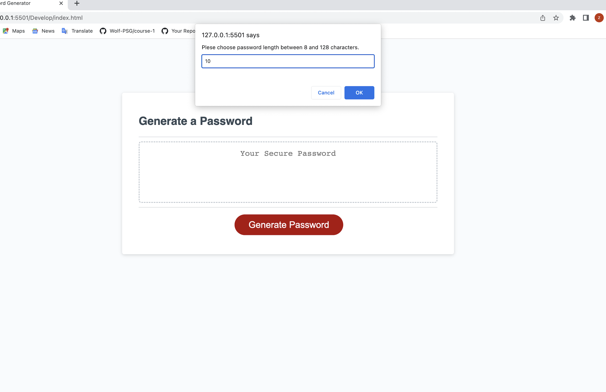
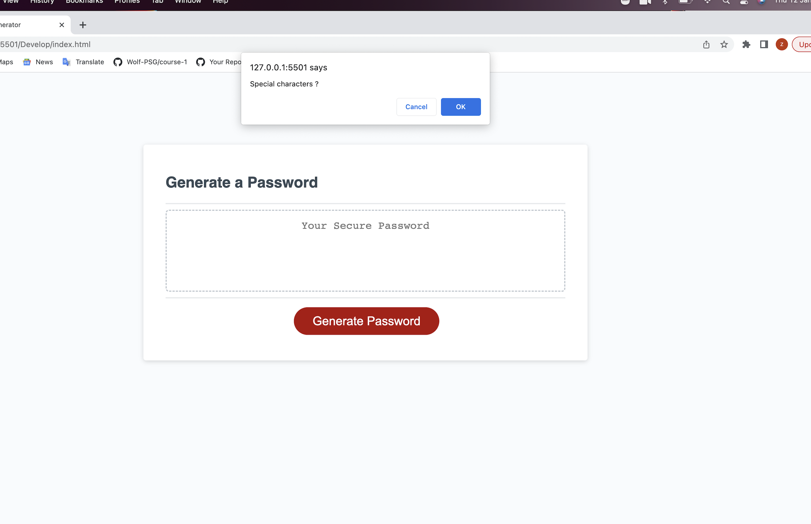
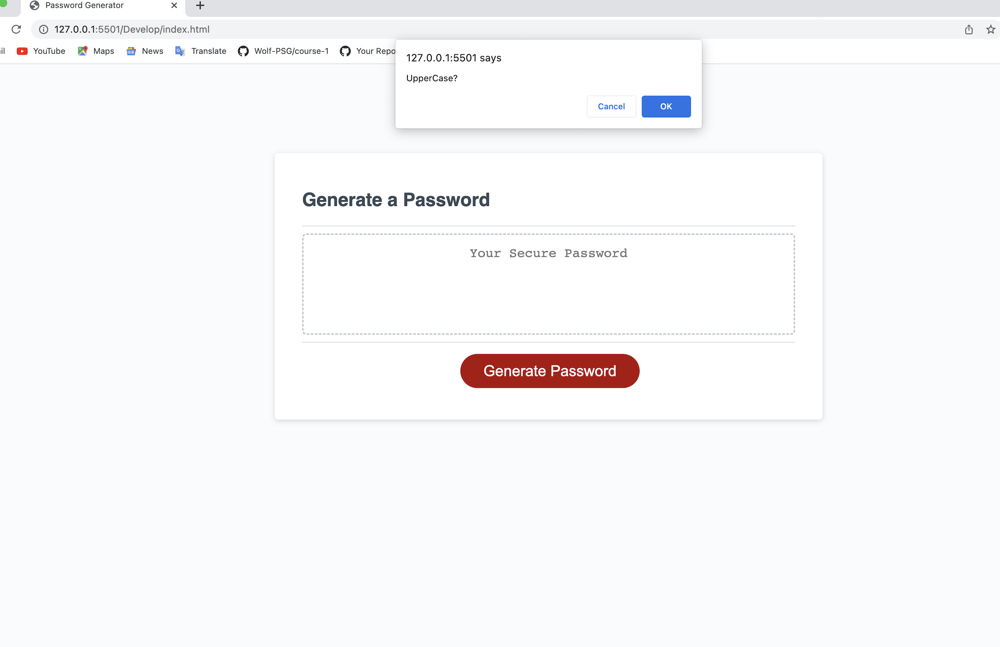
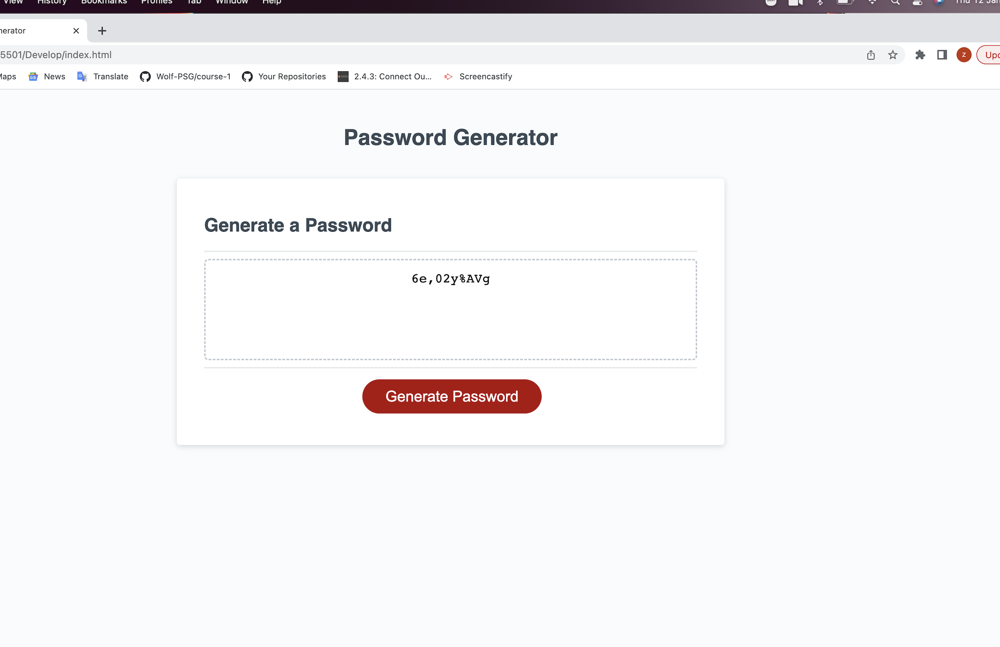

# Password Generator

## Description

It was great experinance to take part to generate password.
I build password generator that ask user to choose 8 to 128 lenght of character to choose.
Also page ask to user if they like to choose number, special character , uppercase letter and lowercase letter.
If users choose less or more  lenght page keep asking same question to choose criteria lenght,
if users not choose any criteria , page alert to choose at leat one character.
I have issue to create remaind users about lentght of character but i figure out sort that with "while loop".
I learn so much with this project!

## Usage

Provide instructions and examples for use. Include screenshots as needed.

To add a screenshot, create an `assets/images` folder in your repository and upload your screenshot to it. Then, using the relative file path, add it to your README using the following syntax:

## License

The last section of a high-quality README file is the license. This lets other developers know what they can and cannot do with your project. If you need help choosing a license, refer to [https://choosealicense.com/](https://choosealicense.com/).

---

🏆 The previous sections are the bare minimum, and your project will ultimately determine the content of this document. You might also want to consider adding the following sections.

## Badges

Badges aren't necessary, but they demonstrate street cred. Badges let other developers know that you know what you're doing. Check out the badges hosted by [shields.io](https://shields.io/). You may not understand what they all represent now, but you will in time.

## Features

If your project has a lot of features, list them here.

## How to Contribute

If you created an application or package and would like other developers to contribute to it, you can include guidelines for how to do so. The [Contributor Covenant](https://www.contributor-covenant.org/) is an industry standard, but you can always write your own if you'd prefer.

## Tests

Go the extra mile and write tests for your application. Then provide examples on how to run them here.

